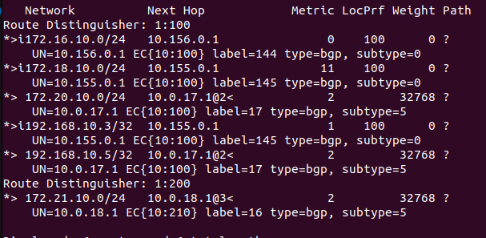
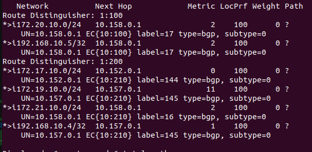
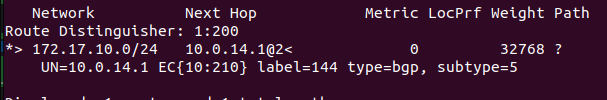
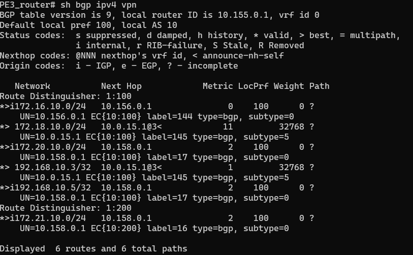
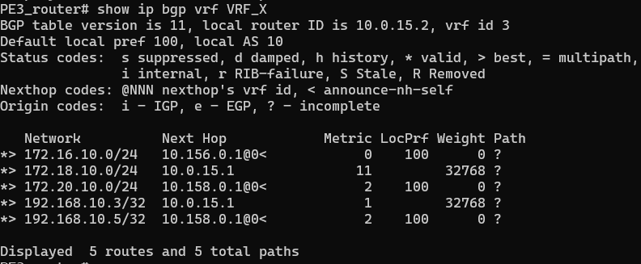
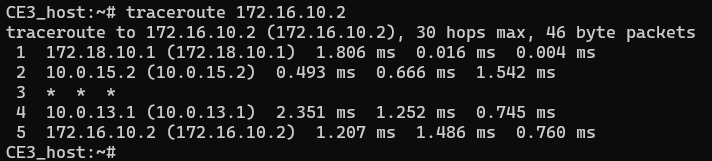

# Projet routage inter-domaine

Une version pdf de ce rapport est disponible dans le dossier rapport.

## sujet 

L’objectif principal de ce TP / mini-projet est d’inter-connecter les différents sous-sites, au moyen de VPN-BGP MPLS, avec un
espace d’adressage privé (attention de ne pas rentrer en conflit avec les autres domaines si vous voulez atteindre la dernière
question facultative) et re-utilisé pour les deux VPN. Votre domaine, son routage interne, et ses liens avec les CE sont déjà préconfigurés; en revanche les liens CE avec leur hôte sont laissés à vos soins ainsi que toute la configuration plus avancée (MPLS,
session iBGP et routage des adresses privées sur le CE – avec leur hôte ou avec des loopback locales).
Pour atteindre les configurations souhaitées vous devrez expérimenter deux pistes : en full-mesh et en hub & spoke. En option
finale, vous pourrez essayer de connecter vos hubs et leurs clients à l’Internet...

## Configuration

Avant toute configuration directe des VPN, notre premiere action était de metre en place les differentes adresse ip et de loopback manquantes sur les différentes instances. Celle-ci pourront être directement consulté sur nos config.
#
### Mise en place d'un VPN en full-mesh:
Dans cette première partie, nous cherchons à mettre en place le VPN X en full-mesh tout en faisant varier le type de protocole de routage au sein des sous-réseaux composant le VPN : static, OSPF et RIP. L'intérêt est double : montrer nos compréhensions des différents protocoles, mais aussi assurer une certaine sécurité à notre mini internet en évitant la dépendance à un seul protocole de communication.

Avant de commencer la configuration des routes statiques en soi, certaines étapes préliminaires doivent être faites.

On commence dans un premier temps par activer le protocole BGP sur notre routeur PE1 tout en spécifiant notre numéro d'AS. Ensuite, la commande "address-family ipv4 vpn" est utilisée pour activer la famille d'adresses IPv4 VPN. Les commandes "neighbor X.X.X.X activate" sont utilisées pour activer les voisins BGP avec les adresses loopback des routeurs d'entrée (PE3 et PE6) liées aux autres sous-réseaux du VPN X. On réalise la même chose sur les routeurs PE3 et PE6 en activant les voisins BGP avec les adresses loopback des routeurs liées aux autres sous-réseaux du VPN X.

```
conf t
router bgp 10
address-family ipv4 vpn
neighbor 10.155.0.1 activate
neighbor 10.158.0.1 activate
```

Dans un deuxième temps, sachant que les nœuds dans différents VPN ne peuvent pas communiquer entre eux, les informations de routage des différents VPN doivent être stockées dans des structures distinctes. Cela est possible grâce à VRF (Virtual Routing and Forwarding), qui nous permet de stocker les informations de routage dans différentes tables (une par VPN). Pour utiliser VRF, les interfaces du routeur connectées à un bord client dans votre AS doivent être assignées à une VRF spécifique. FRRouting s'appuie sur Linux VRF, et les interfaces VRF doivent être créées dans Linux avant que nous puissions les configurer dans FRRouting.

Pour créer les interfaces VRF et les configurer dans les différents conteneurs des routeurs PE du VPN X (et du VPN Y le cas échéant), les étapes sont les suivantes
```
link add VRF_X type vrf table 10
link set VRF_X up
link set port_CE1 master VRF_X  
```

#
### Mise en place d'un routage par route static
Les éléments concernant par cette de communication se trouve dans le sous réseaux du routeur CE1 dans le VPN X.

Les routes statiques sont utilisées pour configurer le routage au sein du VPN. Pour le CE (Customer Edge), une route par défaut est configurée vers son PE (Provider Edge) pour toutes les destinations non locales. Par exemple, sur le CE de l'entreprise Y, une route par défaut est ajoutée dirigée vers son PE.

Pour le PE, une route statique est configurée pour rejoindre son côté du VPN. Cette route statique est partagée avec les autres PEs du VPN via MP-BGP (Multiprotocol Border Gateway Protocol). Cela permet à chaque PE de connaître les routes statiques des autres PEs du VPN.

MP-BGP est utilisé pour transporter les informations liées au VPN, notamment les routes vers les CEs. Les PEs redistribuent les routes statiques dans MP-BGP afin que les autres PEs puissent les connaître. Des étiquettes MPLS sont également ajoutées aux routes pour faciliter le transfert des paquets dans le réseau MPLS.

En résumé, les routes statiques sont utilisées pour configurer le routage entre les CEs et les PEs du VPN, tandis que MP-BGP est utilisé pour partager ces informations de routage entre les PEs du VPN. Cela permet d'établir une connectivité efficace et sécurisée entre les sites du VPN.
Les différentes commandes à mettre en place sur CE1 et PE1 sont les suivantes:  

Pour CE1_host :
```
CE1_host:~# ip route add default via 172.16.10.1 dev CE1router
```
Pour CE1_router:
```
conf t
CE1_router# ip route 172.16.0.0/12 10.0.13.2
```

Pour PE1_router:
```
PE1_router# ip route 172.16.10.0/24 10.0.13.1 vrf VRF_X
PE1_router# conf t
PE1_router(config)# router bgp 10 vrf VRF_X
PE1_router(config-router)# address-family ipv4
PE1_router(config-router-af)# redistribute static
PE1_router(config-router-af)# label vpn export auto
PE1_router(config-router-af)# rd vpn export 1:100
PE1_router(config-router-af)# rt vpn both 10:100
PE1_router(config-router-af)# export vpn
PE1_router(config-router-af)# import vpn
```

sur PE1_router on a donc les config suivantes :

```
...
vrf VRF_X
 ip route 172.16.10.0/24 10.0.13.1
 exit-vrf
!
interface port_CE1 vrf VRF_X
 ip address 10.0.13.2/24
 ip ospf cost 1
!
...
 address-family ipv4 vpn
  neighbor 10.155.0.1 activate
  neighbor 10.158.0.1 activate
 exit-address-family
!
router bgp 10 vrf VRF_X
 !
 address-family ipv4 unicast
  redistribute static
  label vpn export auto
  rd vpn export 1:100
  rt vpn both 10:100
  export vpn
  import vpn
 exit-address-family
!
```
On voit bien que la route vers le vpn X est bien présente. On pourra donc faire un ping depuis CE1_host vers CE3_host et vice versa lorsque les configurations seront faites sur les autres routeurs du vpn X.


#
### Mise en place d'une communication par OSPF

Nous utilisons le protocole OSPF pour établir une communication entre le routeur CE3 et le routeur PE3. Cette configuration permet aux deux équipements de partager leurs routes et d'échanger des informations de routage. Le routeur PE3 redistribue ensuite les routes OSPF apprises dans le protocole de routage BGP (Border Gateway Protocol) utilisé dans le réseau VPN. Cela permet aux autres routeurs PE du réseau de connaître les routes OSPF associées à ce VRF. En utilisant les commandes d'exportation et d'importation VPN, les routes sont partagées entre le VRF et la table de routage globale, assurant ainsi une connectivité et une communication efficaces entre les différents équipements du réseau VPN.


```
PE3_router# conf t
PE3_router(config)# router ospf vrf VRF_X
PE3_router(config-router)# network 10.0.15.0/24 area 0
```
```
CE3_router# conf t
CE3_router(config)# router ospf
CE3_router(config-router)# network 10.0.15.0/24 area 0
CE3_router(config-router)# network 172.18.10.0/24 area 0
CE3_router(config-router)# network 192.168.10.3/32 area 0
```
```
PE3_router# conf t
PE3_router(config)# router bgp 10 vrf VRF_X
PE3_router(config-router)# address-family ipv4
PE3_router(config-router-af)# redistribute ospf
PE3_router(config-router-af)# label vpn export auto
PE3_router(config-router-af)# rd vpn export 1:100
PE3_router(config-router-af)# rt vpn both 10:100
PE3_router(config-router-af)# export vpn
PE3_router(config-router-af)# import vpn
```

Les configurations sur le routeur PE3 sont donc : 
```
interface port_CE3 vrf VRF_X
 ip address 10.0.15.2/24
 ip ospf cost 1
!
...
 address-family ipv4 vpn
  neighbor 10.156.0.1 activate
  neighbor 10.158.0.1 activate
 exit-address-family
!
router bgp 10 vrf VRF_X
 !
 address-family ipv4 unicast
  redistribute ospf
  label vpn export auto
  rd vpn export 1:100
  rt vpn both 10:100
  export vpn
  import vpn
 exit-address-family
!
...
router ospf vrf VRF_X
 redistribute bgp
 network 10.0.15.0/24 area 0
!
...
```
A partir de maintenant on peut ping les host de CE1 et CE3 entre eux.
#
### Mise en place de RIP

Nous utilisons le protocole RIP pour établir une communication entre le routeur PE6 et le routeur CE6A. Cette configuration permet aux deux équipements de partager leurs routes et d'échanger des informations de routage. Le routeur PE6 redistribue ensuite les routes RIP apprises dans le protocole de routage BGP (Border Gateway Protocol) utilisé dans le réseau VPN. Cela permet aux autres routeurs PE du réseau de connaître les routes RIP associées à ce VRF. En utilisant les commandes d'exportation et d'importation VPN, les routes sont partagées entre le VRF et la table de routage globale, assurant ainsi une connectivité et une communication efficaces entre le routeur PE6 et le routeur CE6A dans le réseau VPN.
Idem pour le routeur CE6B.

Note : Il ne faut pas oublier de mettre en places les container et les routes par defaut sur les hôtes.

```
PE6_router# conf t
PE6_router(config)# router rip vrf VRF_X
PE6_router(config-router)# network 10.0.17.0/24 
```
```
CE6A_router# conf t
CE6A_router(config)# router rip
CE6A_router(config-router)# network 10.0.17.0/24 
CE6A_router(config-router)# network 172.20.10.0/24 
CE6A_router(config-router)# network 192.168.10.5/32 
```
```
PE6_router# conf t
PE6_router(config)# router bgp 10 vrf VRF_X
PE6_router(config-router)# address-family ipv4
PE6_router(config-router-af)# redistribute ospf
PE6_router(config-router-af)# label vpn export auto
PE6_router(config-router-af)# rd vpn export 1:100
PE6_router(config-router-af)# rt vpn both 10:100
PE6_router(config-router-af)# export vpn
PE6_router(config-router-af)# import vpn
```
Ici nous rencontrons un problème pour ping le host de CE1 ce qui est bizarre car nous pouvons ping le host de CE3. PE6 connait la route pour aller à CE1 mais n'arrive pas a ping :



Nous ne savons pas quoi faire pour résoudre ce problème étant donné que la route est connue par PE6 et qu'il y a bien une redistribution de RIP vers BGP et de BGP vers RIP.


#
### Mise en place du hub and spoke avec tag

Nous avions travaillé tous les deux de notre coté avec Sofian donc nous avions mis en place le full-mesh sur les 2 vpn (X et Y) donc le travil était en grande parti  fait pour mettre en place le hub and spoke pour le vnp Y. Nous avons donc juste eu à faire les modifications suivantes :  
    - Changer les voisins de PE2,PE4 et PE6 en se limitant a PE5 uniquement pour le vpn Y.
    - Modifier les RT du vpn Y sur PE2,PE6 et PE4 pour qu'ils ne soient plus en full-mesh mais en hub and spoke. C'est à dire mettre des tags différents à l'export et à l'import. Dans notre cas 10:210 en export et 10:200 en import. Sur PE5, il fallait mettre l'inverse pour que cela marche bien.
    - Sur PE5, il fallait ajouter tous les membres du vpn Y en voisin BGP et mettre les bonnes politiques d'import et d'export.

Nous avons mis en place toutes ces config mais nous avons un problème de route : sur PE5 toutes les routes sont apparentes :



Mais sur PE2,PE4 et PE6, la route vers PE5 n'apparait pas :



Nous n'avons pas réussi à comprendre pourquoi la route de PE5 n'apparait pas. Nous avons pensé à une solution qui serait de mettre en place un tunnel MPLS entre PE5 et PE2,PE4 et PE6 mais nous n'avons pas eu le temps de le faire.   


#
### Mise en place du hub and spoke avec RR (route reflector)

Nous n'avons pas eu le temps de mettre en place le hub and spoke avec RR. Mais voici les principes qu'il aurait fallu mettre en place :
    - Sur PE5, il est configuré pour fonctionner en tant que réflecteur de route, ce qui signifie qu'il reçoit les mises à jour de routage des routeurs clients et les reflète aux autres routeurs clients. Le route reflector ne redistribue pas les routes qu'il reçoit, mais les réfléchit aux autres routeurs clients connectés. Cela réduit le nombre total de sessions de peering BGP nécessaires entre les routeurs clients.
    - Sur PE2, PE4 et PE6, chaque routeur client établit une session de peering BGP avec le route reflector. Les routeurs clients envoient leurs mises à jour de routage (routes) au route reflector, qui les reflète ensuite aux autres routeurs clients. Les routeurs clients ne sont pas directement connectés les uns aux autres, mais ils communiquent via le route reflector.

En utilisant cette architecture hub and spoke avec un route reflector, il est possible de réduire le nombre de sessions de peering BGP nécessaires, ce qui simplifie la configuration et améliore l'efficacité du routage dans un réseau de grande taille. Nous aurions pu ainsi mettre à jour les session iBGP entre PE2,PE4 et PE6 pour qu'ils se connectent à PE5 et non plus entre eux.

#
## Réponse aux questions :
### Question 1

1. BGP est utilisé pour l'échange des informations de routage entre les routeurs des différents sites VPN, tandis que MPLS (Multiprotocol Label Switching) est utilisé pour acheminer les paquets à travers le réseau en utilisant des chemins prédéfinis basés sur des étiquettes. BGP permet de déterminer les meilleures routes pour atteindre les destinations spécifiques, tandis que MPLS offre une commutation rapide des paquets et une connectivité sécurisée entre les VPN. En résumé, BGP facilite le routage des données, tandis que MPLS assure un acheminement efficace des paquets.

2. Nos resultats de tests pour le plans plan de contrôle et de données sont :

Pour le plan de controle:

- "show ip bgp ipv4 vpn" : Cette commande affiche la table BGP pour les routes VPN spécifiques à l'adresse IPv4. Elle permet de vérifier si les routes VPN sont correctement annoncées et apprises. On peut y vérifier les informations telles que les adresses réseau, les prochains sauts (next hop), les métriques, etc  



- "show ip bgp vrf VRF_Y" : Cette commande affiche la table BGP pour une VRF spécifique (dans cet exemple, VRF_Y). Elle permet de vérifier les routes BGP spécifiques à cette VRF, y compris les informations sur les adresses réseau, les prochains sauts, les métriques, etc. On observe une sorti coherente avec ce que l'on souhaite au niveau des networks.



- "show ip route vrf VRF_Y" : Cette commande affiche la table de routage pour une VRF spécifique (VRF_X dans ce cas).


   Aprés analyse de chaque retour de commandes, les networks, liens, neighbors et vrf sont tous bien configuré avec les bonnes adresses de loopback, IP et les bonnes metriques. on y retouve bien chaque instances du VPN X sur PE1 et PE6 dans les table de PE3

Pour le plan de données:
    - Pour vérifier cette partie, nous pouvons effectuer des pings et des traceroutes et analyser les sorties. Les deux commandes fonctionnes et la route observer sur la capture ci-dessous est coherente pour la fin. En revanche, nous obtenons souvent une latence au milieu du cheminement.  


3. Cette partie n'a pas eu le temps dêtre traité. En effet, nous avions préféré nous lancer sur le hub and spoke. Mais dans les grandes lignes :
En ajoutant un nouveau préfixe IP privé dans le VPN X à partir d'un CE spécifique, en lui attribuant une loopback, nous devrions observer que ce préfixe est propagé aux autres sites du VPN via BGP. Cela permettra une connectivité transparente entre les sites et facilitera l'acheminement des paquets vers la nouvelle adresse IP privée.

#
## Question 2

1. Nous avons identifié deux approches possibles pour configurer cette solution. La première méthode consiste à utiliser des tags MPLS pour diriger le trafic entre le hub et les sites spoke. Chaque site spoke envoie son trafic vers le hub en utilisant un tag MPLS spécifique, permettant ainsi au hub de router les paquets vers les sites spoke appropriés. En outre, le hub doit relayer la signalisation iBGP pour maintenir une connectivité juste.

La deuxième approche consiste à utiliser un route reflector pour faciliter la communication entre les différents nœuds du VPN Y. Dans cette configuration, le hub est configuré en tant que route reflector, tandis que les sites spoke sont configurés en tant que clients du route reflector. Cette configuration permet au route reflector de refléter les routes reçues de chaque site spoke vers tous les autres sites, assurant ainsi une connectivité complète au sein du VPN Y. En plus de cela, le route reflector assume également la responsabilité de relayer la signalisation iBGP pour maintenir la cohérence et la synchronisation du réseau.

En examinant ces deux approches, nous constatons que la configuration en hub & spoke avec des tags permet une gestion plus granulaire du routage et une manipulation précise du trafic entre les sites. D'un autre côté, l'utilisation d'un route reflector facilite la gestion et l'administration du réseau, en permettant une propagation automatique des routes vers tous les nœuds du VPN Y.


2. Testez et expérimentez le plan de contrôle comme le plan de données.

    Cf la partie sur hub and spoke des configurations.

3. Appliquez des filtres/politiques sur le hub.
    Cela n'a pas été réalisé.
#
## Question 3 (pas traité mais expliqué dans les grandes lignes)

Pour connecter notre hub VPN Y à l’IXP 81 pour offrir une connexion Internet au VPN Y, le cheminement est le suivant:

    - Configurez une interface de bouclage sur le routeur de bordure (PE5) et annoncez-la dans le protocole de routage iBGP.
    - Configurez une interface de bouclage sur le routeur de bordure (PE5) et annoncez-la dans le protocole de routage BGP.
    - Configurez une interface de bouclage sur le routeur de bordure (PE5) et annoncez-la dans le protocole de routage OSPF.

Ces étapes permettent d’annoncer l’adresse IP publique du routeur PE5 à l’IXP 81. Ensuite, nous devons configurer le routeur PE5 pour qu'il annonce les préfixes du VPN Y à l'IXP 81. 


